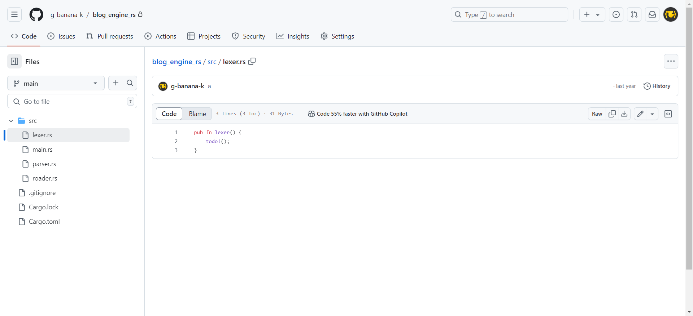

BananaLinoleumです。またサイトを作り直しました。

# 今までと違うところ
## Markdown対応
**ようやくMarkdownに対応しました！！！**

1年間くらいずっとtodoリスト(そんなものないけど)の中で眠っていたMarkdown対応が実現されました。

中身的にはただ[Remark](https://github.com/remarkjs/remark)でパースしてHTMLに変換しているだけです。(Front Matterのために[parseMD](https://github.com/arpanpal010/parsemd)も使ってはいる)

## (ほぼ)JavaScript不使用
[サイト内検索](/search)を除いてページ内でJavaScriptを(現状)全く使っていません。

前はフッターとヘッダーを挿入するためだけに全ページで使ってました。

まあ生成とデプロイは全部TypeScriptだけど、結果物に残ってないしaltJSだからノーカンということで...

## 無効なリンクが赤くなる
[こういう感じ](/lorem_ipsum_dolor_sit_amet)で存在しないサイト内リンクを貼ると赤くなるようになりました。

Markdownから変換するときに調べているだけです。外部リンクは全部青か紫になります。

どうでもいいけど"無効なリンクが赤くなる"ってリズムがいいですね。"しかのこのこのここしたんたん"とか"スマホを落としただけなのに"と同じものを感じる。

# SSGはいいぞ
Nextみたいなキラキラ技術スタックは使ってないしSSGが実際何なのかもよくわかってませんけがこのサイトはSSGで出来ています。絶対にSSGで出来ています。（断言）

VanillaTS(?)でディレクトリ内のファイルを全部いい感じに変換していい感じにしています。

さっき上げた三つもSSGのおかげで楽に実現できました。

さらに身長が190cmになり頭髪の後退も止まりミュージシャンの兄ができました。**さあ、みんなもSSGしよう！**

# おまけ
去年の４月ごろに同じようなことを試みた形跡がありました。

もう少し頑張れなかったのだろうか。
